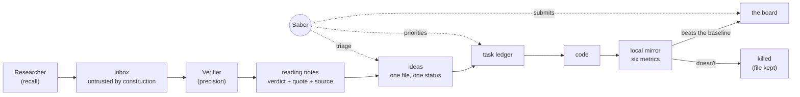
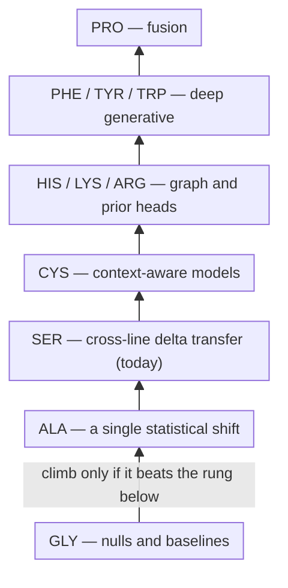

Silence one gene in a human cell and thousands of others move — a few because the protein you removed was regulating them directly, most through chains of consequence nobody has fully mapped. The Arc Institute's [Virtual Cell Challenge 2026](https://virtualcellchallenge.org) asks whether a model can predict that movement in cells it has never seen: six anonymized cell lines, and for each one a list of 300 genes to silence plus 18,400 untouched control cells — nothing else. For every knockdown you submit 400 simulated cells, each a full 18,533-gene expression profile in raw counts, 360,000 cells per submission, scored against real held-back experiments on six metrics. Arc ships no training data this year; everyone starts from the same public corpus and whatever else they can bring.

Sidechain is my entry. Solo, formally. In practice it runs like a small research group in which I am the only human — the rest of the group is Claude Code, split into agents with deliberately narrow jobs — and most of this post is about the machinery that keeps a group like that honest.

## How the group works

A Researcher agent sweeps the literature and the data repositories and writes what it finds into an inbox that is untrusted by construction: a citation there has not been verified, a claim there has not been read in full. A separate Verifier settles claims one at a time — a verdict, a verbatim quote, a source that resolves today. The two are separate on purpose: the Researcher is tuned for recall and its failure mode is confident volume, the Verifier is tuned for precision, and an agent that does both grades its own homework.

What survives verification becomes an idea: one file per idea, carrying exactly one of seven statuses on its way from `raw` to `kept` or `killed`. Killed files are never deleted — half the value of the directory is knowing what has already been ruled out and why, and it stops us retrying the same trick in November. Ideas that earn it get promoted to a task ledger, tasks become code, and code is trusted exactly never — until a local mirror of Arc's own six-metric evaluation has scored it.

My job is the biology, the priorities, and the final word. Triage out of the inbox is a deliberate human step, nothing reaches the leaderboard or this site without going through my hands, and Claude has learned to end its recaps with a "need from you" list. The technical term is human-in-the-loop; some days it feels closer to human-in-the-way.

And because agents drift, the paper trail is machine-checked. Small scripts validate every status word against the closed vocabulary, resolve every cross-reference between ideas, tasks and reports, and re-read the measured numbers quoted in the running analysis — failing loudly when one no longer matches. A stale fact in a document is a test failure here, not a silent lie.

## The ladder

House rule number one: build the simplest model first, score it, and climb only when the next rung beats the one below. You always keep a working baseline, and you never add complexity the metric won't pay for.

The families are named after amino acids — a side chain is what makes one amino acid different from another, which is also where the project got its name. The series climb from GLY, the nulls and baselines, through SER, the cross-line delta-transfer models doing the work today, toward context-aware bridges, graph and prior heads, and the deep generative heavyweights.

Every knob a model carries goes into its name at birth, as a letter, and a name is never changed after it has been scored — which makes the standings table on the landing page read like an ablation study instead of a highlight reel.

## Built in the open

Two repositories. The public one holds the *what*: the code, the configs, the tests, the agent briefs, this site. A private one holds the *why*: live strategy, half-formed ideas, results we haven't finished arguing about. The routing rule is one line — publishing a private file later costs one commit, un-publishing a public one costs a history rewrite, so anything unsure stays private until it stops being live. Negative results and methodology are always fair game, and honestly the better content anyway.

The numbers on this site keep the same discipline as the ledgers: the standings table is generated from leaderboard snapshots, never hand-edited, and an entry's rank is the first snapshot that contains it — it stays put even when the board moves.

## Where to read more

The code and the agent briefs are on [GitHub](https://github.com/saberhq/sidechain). The [landing page](/) carries the scored submissions and the series cards; the longer write-ups land here as [posts](/posts/), and progress notes go out on [LinkedIn](https://www.linkedin.com/in/saberhq). The final three cell lines arrive on October 22 and the deadline is November 5 — until then, everything is a rehearsal with a scoreboard.
